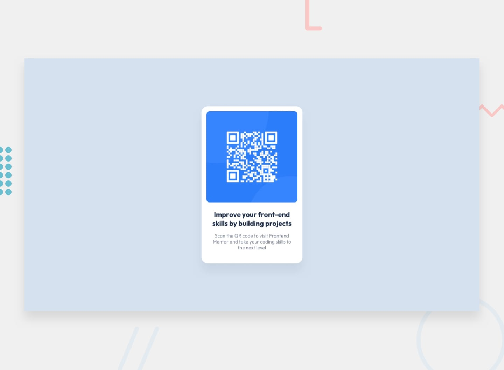

# Frontend Mentor - QR code component

## Welcome! 👋

[Frontend Mentor](https://www.frontendmentor.io) challenges help you improve your coding skills by building realistic projects.

**To do this challenge, you need a basic understanding of HTML and CSS.**

## The challenge

Build out the QR code component and get it looking as close to the design as possible.

## Deploying your project

- [GitHub Pages](https://pages.github.com/)

**Have fun building!** 🚀
